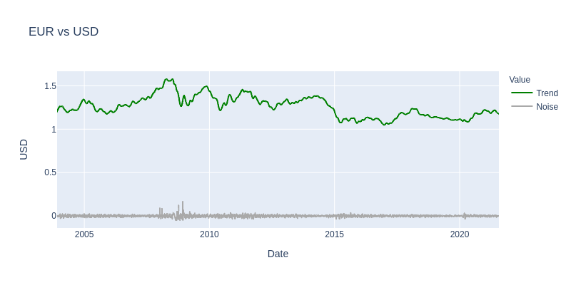
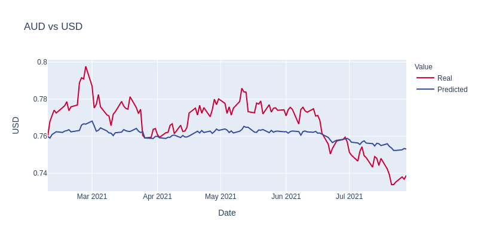
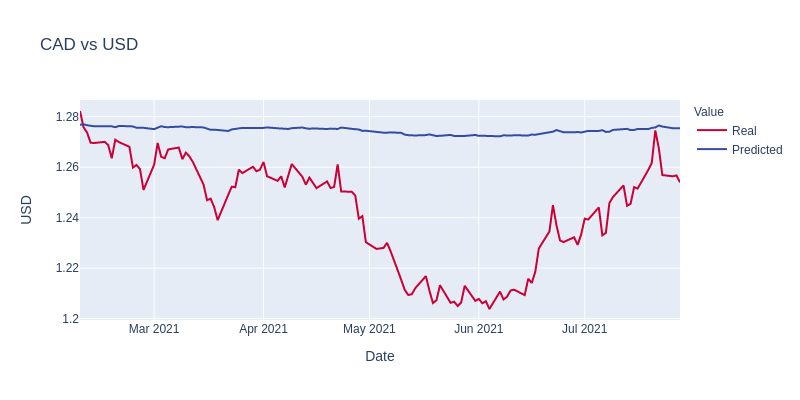
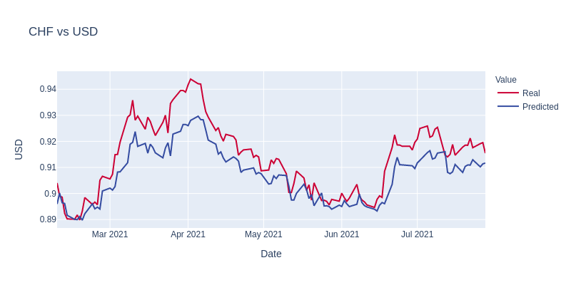
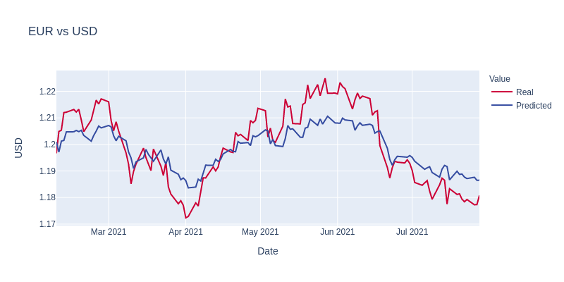
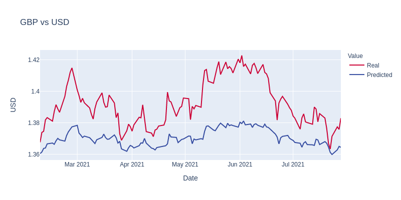
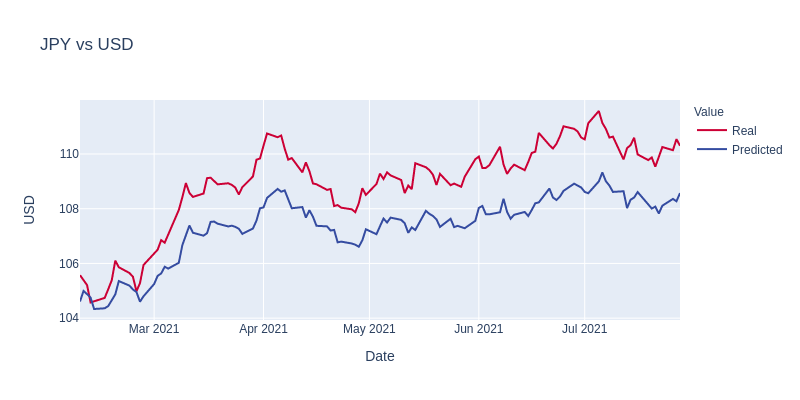
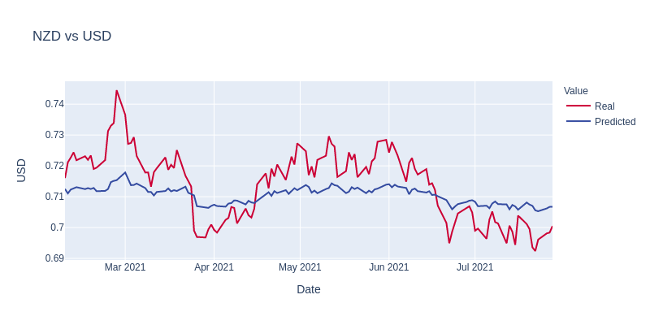

# Can Machine Learning be used to predict FOREX closing price?


## Data:
* Top 7 FOREX vs USD
* Standard financial features: Open, High, Low, <b>Close</b>, Volume
* "Daily" entries
* Downloaded from [TradingView](https://www.tradingview.com)

## Model chosen: Long Short-Term Memory (LSTM)
* Well-suited for making predictions based on our type of data
* Commonly-used, there are many projects on [Kaggle](https://www.kaggle.com/) and other sites for reference
* Accessible at the beginner level with limited tuning capability

## Data preparation:
```
# Import, trim and clean data
df = pd.read_csv(f'Data/{currency}.csv', index_col="Date", infer_datetime_format=True, parse_dates=True)
df = df['2020':]
df.dropna(inplace=True)
df.head()
```

## Tuning & Evaluation:
* Verify that loss is not 'nan' while training model
* Plot Real vs Predicted values to see if any similarity
* Adjust model variables
* Trim data to one year
* Use supplemental trend vs noise visualizations to help in data selection



## Predicted vs. Real values:









## Conclusion:
* Predicting the closing price for FOREX <b><i>is possible</i></b> by training the LSTM neural network.
* The ideal use would be for predicting the next day's closing price based on today's data.
* There are many options for tuning the model that were not implemented in this project.


## Links:

* [Exploding Gradients by machinelearningmaster.com](https://machinelearningmastery.com/exploding-gradients-in-neural-networks/)
* [Exploding Grading Problem by deepai.org](https://deepai.org/machine-learning-glossary-and-terms/exploding-gradient-problem)